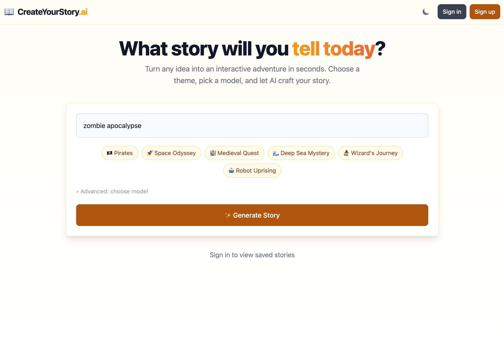
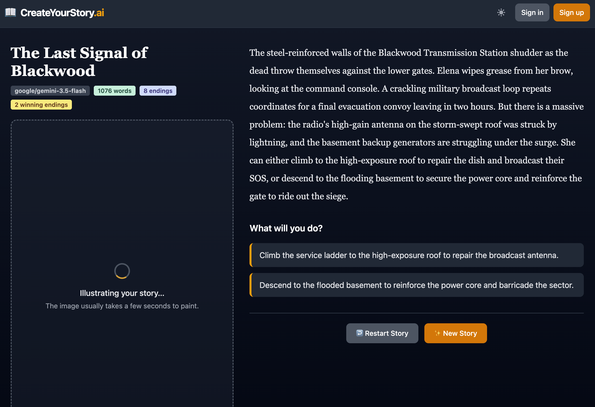
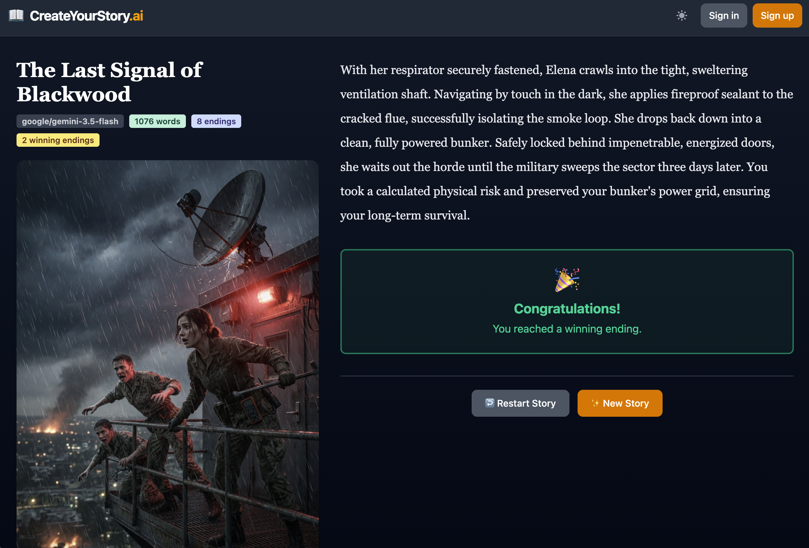
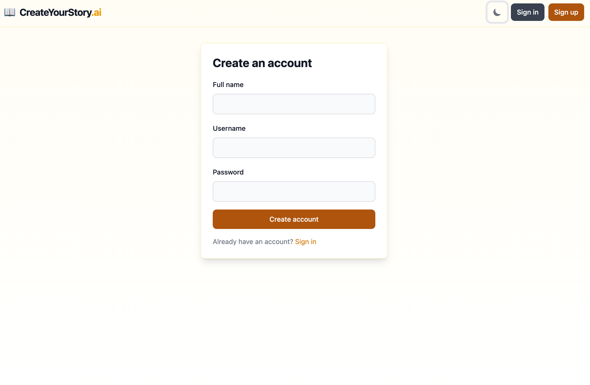

# CreateYourStory.ai

CreateYourStory.ai turns a simple idea into a playable choose-your-own-adventure story. Choose a theme, generate a branching story, and make decisions that lead to different endings.

[Try the live demo](https://createyourstory-ai-backend.onrender.com/)

## Preview

<p align="center">
  
</p>

<p align="center">
  <em>Start with a theme, then explore the story one choice at a time.</em>
</p>

|                                        Create a story                                        |                            Explore different paths                             |
| :------------------------------------------------------------------------------------------: | :----------------------------------------------------------------------------: |
|  |  |

<p align="center">
  
</p>

## What it does

- Generates branching stories from a theme or prompt.
- Lets users choose from several supported AI models.
- Presents each story as an interactive decision tree with winning and losing endings.
- Generates a cover illustration after the story is created.
- Supports accounts for saving, revisiting, and deleting stories.
- Also supports generating a story as a guest through a session cookie.

## How it works

The frontend sends a story request to the FastAPI backend. The backend creates a persisted job, then generates the story in the background. The language model returns a structured story graph, which Pydantic validates before the backend stores its nodes and choices with SQLModel. The React client polls the job until it is complete, then traverses the graph locally as the reader makes choices.

Image generation follows the same general pattern: once story generation finishes, the API creates an image job and the frontend polls for the illustration while the user reads.

```text
React + TypeScript
        │
        ▼
FastAPI REST API ── background jobs ── language/image models
        │
        ▼
SQLModel + SQLite
```

## Engineering highlights

- **Structured AI output:** The model is asked for a story graph rather than free-form text. Pydantic models validate the title, root node, choices, and ending metadata before anything is saved.
- **Graph-based story model:** Stories are persisted as nodes and options, which keeps branching paths explicit and makes them easy for the frontend to traverse.
- **Non-blocking generation flow:** Story and image generation use persisted job records with `pending`, `processing`, `completed`, and `failed` states. The client polls for progress instead of waiting on one long request.
- **Authentication and ownership:** JWT tokens, Argon2 password hashing, optional guest sessions, and authorization checks keep saved stories associated with their owners.
- **Consistent API errors:** FastAPI exception handlers convert validation, authentication, authorization, job, and generation failures into a predictable response format for the frontend.
- **Simple deployment model:** FastAPI can serve the compiled Vite frontend alongside the API, which keeps the project easy to deploy as one service.

## Tech stack

**Frontend**

- React 19 and TypeScript
- Vite
- React Router
- TanStack Query for server state and polling
- Flowbite React and Tailwind CSS

**Backend**

- Python 3.13+
- FastAPI and Uvicorn
- SQLModel / SQLAlchemy
- SQLite by default
- LangChain with OpenRouter for text and image generation

**Authentication**

- JWT access tokens
- Argon2 password hashing via `pwdlib`

## Local development

### Prerequisites

- Node.js and npm
- Python 3.13 or newer
- [`uv`](https://docs.astral.sh/uv/)
- An [OpenRouter](https://openrouter.ai/) API key

### 1. Configure the backend

Copy the backend environment template and add your API key:

```bash
cp backend/.env.example backend/.env
```

The template contains the local defaults:

```env
API_PREFIX=/api
DEBUG=false
DATABASE_URL=sqlite:///./database.db
OPENROUTER_API_KEY=your_openrouter_api_key
JWT_SECRET_KEY=replace_with_a_long_random_secret
```

Replace both placeholder values before starting the backend. Keep `JWT_SECRET_KEY` private and use a different value in each environment. You can generate a suitable value with:

```bash
python -c "import secrets; print(secrets.token_urlsafe(32))"
```

Install the Python dependencies:

```bash
uv sync --project backend
```

Start the API:

```bash
cd backend
uv run uvicorn main:app --reload
```

The API and interactive documentation will be available at:

- API: `http://localhost:8000`
- Swagger UI: `http://localhost:8000/docs`

### 2. Configure and start the frontend

In `frontend/.env`, set the backend URL:

```env
VITE_BASE_URL=http://localhost:8000
```

Then install dependencies and start Vite:

```bash
cd frontend
npm install
npm run dev
```

The frontend will print its local URL, usually `http://localhost:5173`.

### Build

The repository includes a build script that installs frontend dependencies, builds the Vite app, and syncs backend dependencies:

```bash
./build.sh
```

## Current limitations and next steps

- Story illustrations are currently stored as base64 data in the database; object storage would be a better fit as usage grows.
- Background work currently uses FastAPI background tasks rather than a dedicated job queue.
- Story editing and regeneration are not implemented yet.
- Model selection and generation costs need additional controls for a larger deployment.
- SQLite is convenient for local development, but a production deployment would need an intentional persistence and database strategy.

## License

This project is currently a personal portfolio project.